# deckblaster

Linux Stream Deck setup — config-file driven, live-reloading, scriptable — config-file driven, live-reloading, scriptable.

## Hardware

**Elgato Stream Deck MK.2** (15 keys, 5×3 grid) connected via USB on Linux.

---

## What's in Here

| Directory | Purpose |
|---|---------|
| `deckmaster/` | Forked & extended Stream Deck daemon (the active solution) |
| `deckmaster/decks/<plugin>/` | Each plugin: `.deck` config + scripts + `assets/` |
| `docs/` | Research notes and design decisions |

---

## Chosen Solution: deckmaster

We evaluated **7 different Stream Deck Linux projects** before settling on a fork of
[muesli/deckmaster](https://github.com/muesli/deckmaster). See the full
[assessment and comparison →](docs/assessment.md).

### Why deckmaster?

Our hard requirements were:

1. **Config-file driven** — no mandatory UI
2. **Live config updates** — hot-reload while running
3. **Live key notifications** — push dynamic content to specific keys at runtime

deckmaster is the only project that meets all three:

- ✅ **Pure TOML config** — `.deck` files, no UI whatsoever
- ✅ **Auto file-watcher** — we added `fsnotify` so the deck reloads within 200 ms of any `.deck` file save (no `SIGHUP` needed)
- ✅ **HTTP API** — we added a `/key/<n>` endpoint so scripts can push live updates to individual keys (used for calendar alerts, slot machine animations, calculator display, mouse highlighter status)
- ✅ **Command widget** — runs shell commands on a configurable interval and renders output on keys; perfect for HA light states, virtual desktops, Zoom status
- ✅ **Small, hackable Go codebase** (~800 lines) — easy to fork and extend
- ✅ **Multi-page decks** with navigation, short/long press actions, icons + text

### Why not the others?

| Project | Reason rejected |
|---|---|
| [OpenDeck](https://github.com/nekename/OpenDeck) | UI-first (Tauri/Svelte app), no config-file workflow, heavy deps |
| [StreamController](https://github.com/StreamController/StreamController) | UI-first (GTK/Flatpak), no config-file workflow, high memory usage |
| [streamdeck-ui](https://github.com/timothycrosley/streamdeck-ui) | Stale (2 yr+), Python/Qt, UI-mandatory |
| [streamdeck-tricks](https://github.com/lornajane/streamdeck-tricks) | Personal project, not general-purpose |
| [dh1tw/streamdeck](https://github.com/dh1tw/streamdeck) | Raw Go library only — no config system, would need building from scratch |
| [muesli/streamdeck](https://github.com/muesli/streamdeck) | Low-level library (deckmaster's own dependency), stale |

---

## Our Additions to deckmaster

| Feature | Description |
|---|---|
| `--watch` flag | `fsnotify`-based auto-reload on `.deck` file change |
| `--api :9990` flag | HTTP API: push live updates to individual keys |
| `icon` / `icon_command` fields | Static and dynamic icon support in the command widget |
| Solid-color background fill | HTTP API accepts `background` hex color to fill a key before rendering text |
| Error resilience | Widget update errors log to stderr instead of killing the process |

---

## Quick Start

```bash
# Build
cd deckmaster
go build ./...

# Run (manually)
./deckmaster --watch --api :9990 --deck decks/test.deck

# Or via systemd (auto-starts when /dev/streamdeck appears)
systemctl --user start streamdeck.service
systemctl --user status streamdeck.service
journalctl --user -u streamdeck.service -f
```

## Rebuilding After Code Changes

```bash
cd deckmaster
go build ./...
systemctl --user restart streamdeck.service
```

## Config-only Changes

Just save the `.deck` file — the `--watch` flag auto-reloads within 200 ms. No restart needed.

---

## Plugins

### Main

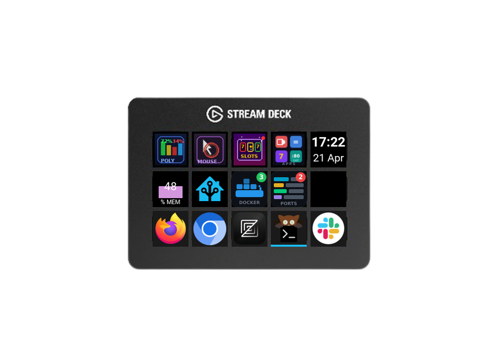 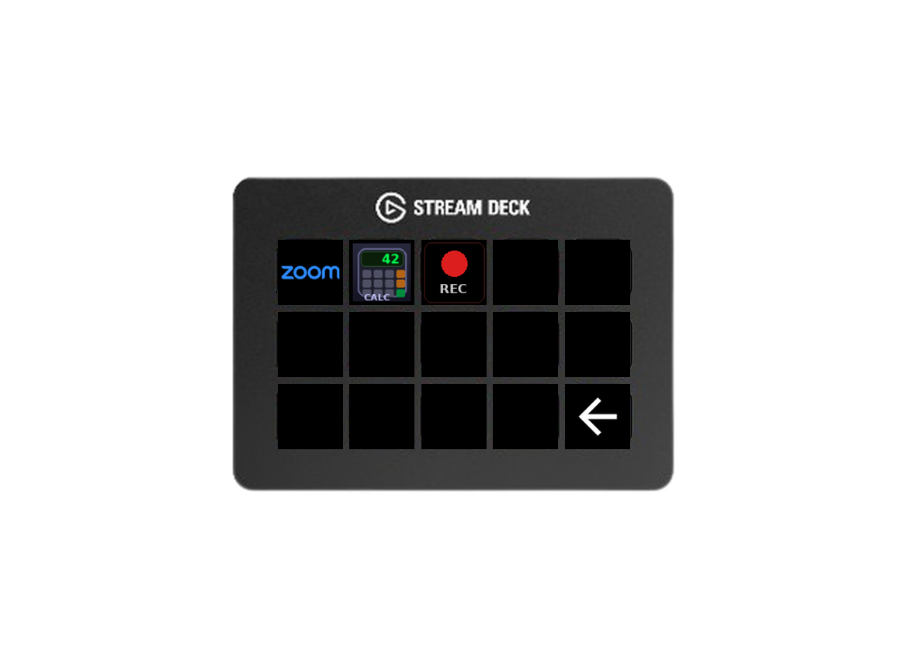


Home screen. Shows clock, RAM gauge, next calendar event countdown, and a virtual desktop switcher (bottom row). Navigation buttons reach all other plugins.

Secondary screen navigation hub. Quick-launch for Zoom, Calculator, and the screen recorder.

---

### Home Assistant

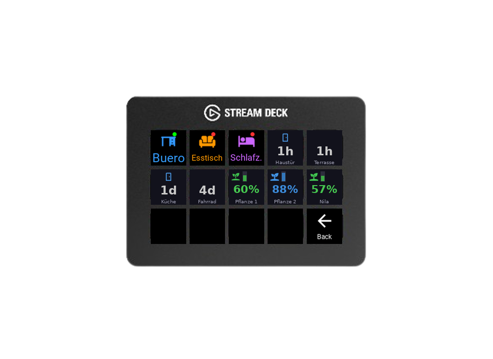

Controls lights and switches in multiple rooms. Monitors door sensors (last opened / currently open) and soil moisture sensors. Room icons show live on/off state with a coloured dot.

**Language:** Python (`uv`) · **Requires:** `imagemagick`, HA token + URL in `~/.config/streamdeck.env`

---

### Zoom

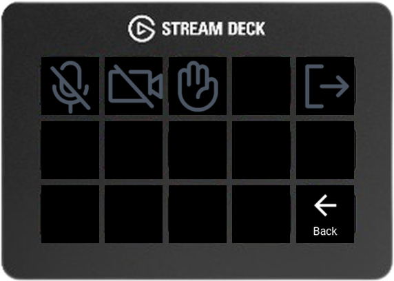

Meeting controls: mute/unmute, video on/off, raise/lower hand, leave. All buttons show grey no-meeting icons when Zoom is not running and switch to coloured icons when a meeting is active.

**Language:** Python (stdlib only) · **Requires:** `xdotool`

---

### Slot Machine

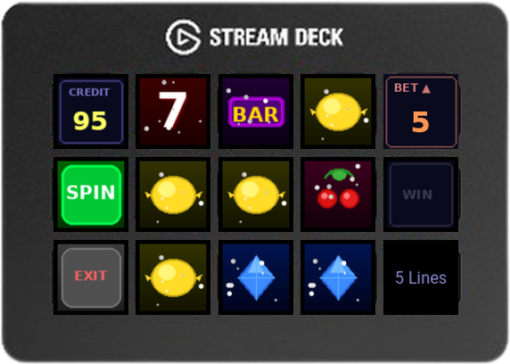

Fully animated slot machine with 7 symbols, 5 pay lines, bet cycling, win detection, glitter animations and a credits display. State persists across restarts; resets to 100 credits when broke.

**Language:** Python (`uv`)

---

### Calculator

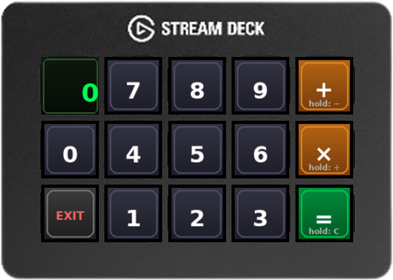

LCD-style calculator. Supports chained operations, 12-digit input, division-by-zero error handling. Long-press `+` for `−`, `×` for `÷`, `=` for clear.

**Language:** Python (`uv`)

---

### Mouse Highlighter

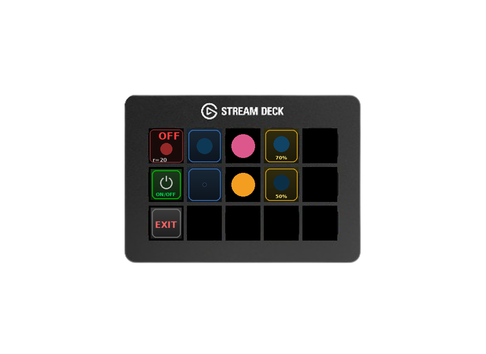

Controls a cursor highlight circle (X11). Adjust radius, colour (uses pywal palette), and opacity live. Each parameter button shows a preview of the *next* value before you press it.

**Language:** Python (`uv`) · **Requires:** X11, bundled `highlight-pointer` binary

---

### Polymarket

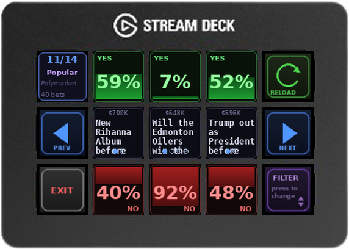

Browse trending prediction market bets. Shows YES/NO percentages for three markets per page with pagination, category filtering, and auto-refresh. Press a text key to scroll long titles.

**Language:** Python (`uv`) · **Requires:** internet access

---

### Docker

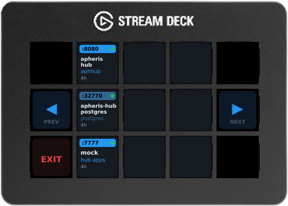

Shows all containers (running/stopped/paused) with image name, mapped port and uptime. Press a container to start/stop it. Paginates when you have more than 9 containers.

**Language:** Bun / JS · **Requires:** `bun`, `docker`

---

### Ports

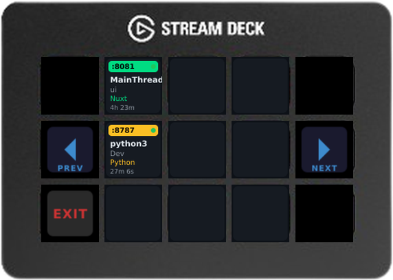

Lists all listening dev-server ports — filters out system processes and shows port, process name, project directory and framework (Next.js, Vite, Django, …). No external package needed; scanner is inlined.

**Language:** Bun / JS · **Requires:** `bun`, `ss` (iproute2)

---

### Virtual Desktops

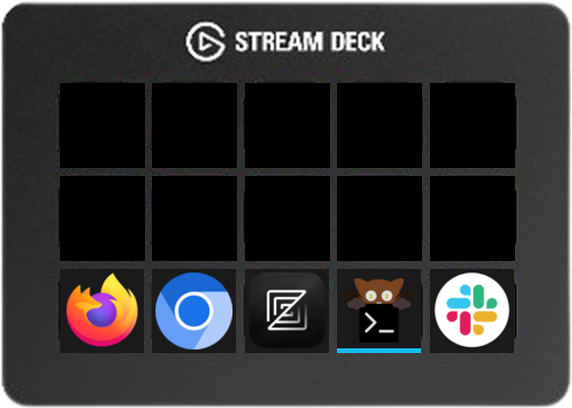

Bottom row of the main deck. Each button shows the apps open on that virtual desktop using GTK icon theme lookup. The active desktop gets a blue underline. Press to switch. Icons are re-rendered every 3 seconds by a background poller.

**Language:** Python (stdlib + `python3-gi`) · **Requires:** X11, `xdotool`, `python3-gi`, `gir1.2-gtk-3.0`

---

### Stream Deck Recorder

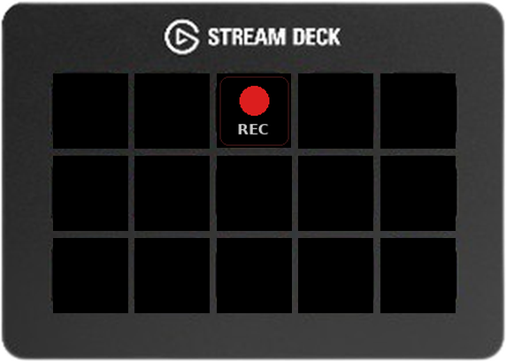

Single button on the Apps page. Records the Stream Deck's own button display at 5 fps and encodes to `~/Videos/` on stop. Each frame is composited onto the Stream Deck photo template.

**Language:** Python (stdlib only)

---

## Documentation

- [Solution assessment & project comparison](docs/assessment.md)
- [Extracting icons from Elgato plugins](docs/plugin-icons.md)
- [Prior art & research links](docs/prior-art.md)
- [Scripts README](scripts/README.md)
